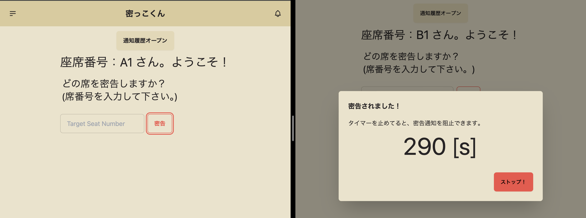

# 密っこくん (フロントエンド)
---
## 概要
このアプリは居眠りしている人を密告できるアプリです。
内部のテキストを変えることで様々な場面で使用できます。

## 前提
- バックエンドは以下URLを使用して下さい。(または参考にして下さい。)
  - https://github.com/Inoue416/mikkokun-backend
- このアプリは座席番号がある場面で使用できます。
- 開発途中のため、まだまだ汎用的に使用することはできません。

## 技術スタック
- TypeScript
- React
- Next.js
- TailwindCSS
- daisyUI
- Websocket通信
- pnpm

他の詳細はpackge.jsonを参照して下さい。


## コマンド一覧
```
pnpm dev         # 本番環境https実行　(未実装)

pnpm dev-http    # local環境でhttpアプリ起動

pnpm fomatter    # fomatter実行

pnpm lintter     # lintter実行

pnpm build       # build

pnpm safe-fixed  # formatter and lintter + α 問題箇所があれば修正
```

## 実行画面
### ホーム画面


### 密告画面



### タイムオーバーによるブロードキャスト


## 注意
- 開発途中のため不完全、バグがある場所が多く存在する可能性が高いです。ご使用際は自己責任でお願いします。

